# PD-1: durable workflows

Status: Proposed

Depends on: [PD-2](PD-2.md), [PD-4](PD-4.md)

Back to the [roadmap](../../ROADMAP.md#proposed).

## Decision summary

Add a durable workflow profile to ALLEN. This profile stores typed workflow
state at explicit checkpoints. It also supports durable events, timers, and
child-work references.

A durable workflow can continue after a process stops. It does not replay a
completed mutation when it resumes.

## Problem

ALLEN `0.1` owns tasks and opaque handles for one execution. The runtime closes
these values when the execution ends. This rule is correct for a bounded task.

Long work has a different failure model. A workflow can wait for an approval
for several days. A host can stop after a tool changes external state. A new
host must then continue the work without loss or duplicate actions.

Restarting the entry function is not sufficient. The entry function cannot
know which prior effects completed. Replay also does not execute a live effect.
Replay only reproduces a recorded boundary result.

## Scope

This proposal adds:

- A stable workflow identity.
- Versioned workflow state.
- Explicit atomic checkpoints.
- Durable external events.
- Durable timers.
- Durable references to supported child work.
- Resume, cancel, complete, and fail operations.
- A canonical workflow history.
- State migration between approved artifact versions.

This proposal does not make all runtime values durable. `Future`, `Task`,
`Workspace`, and other execution-local handles remain invalid at a checkpoint.

## Terms

A workflow is one durable program instance.

A run is one process execution of that workflow.

A checkpoint is an atomic record of state and history position.

An event supplies typed external input to one waiting workflow.

A workflow history is the ordered record of checkpoints, events, timers, and
effect receipts.

## Proposed contract

The manifest declares each durable workflow. It also declares its input,
output, state type, effects, and limits.

The compiler checks that workflow state has a canonical encoding. The compiler
rejects an execution-local handle in workflow state.

The runtime gives each workflow an opaque `WorkflowId`. Source can compare a
workflow ID only when the contract permits comparison. Source cannot construct
or modify an ID.

Illustrative future syntax follows. This syntax is not valid ALLEN `0.1`.

```allen
record ReleaseState {
  approval: Option<ApprovalReceipt<ReleasePlan>>
  published: Option<EffectReceipt<PublishResult>>
}

durable workflow release(input: ReleasePlan)
  state ReleaseState
  returns ReleaseResult
  effects [workflow.checkpoint, workflow.event, tool.release.publish@1] {
  let approval = await event.wait<ApprovalReceipt<ReleasePlan>>(
    "release-approval"
  );

  checkpoint ReleaseState {
    approval: Some(approval),
    published: None,
  };
}
```

## Concrete example: package release

This example releases one package after a pull request merges. The workflow
uses named tools and typed external events.

The names below are proposed examples. They are not part of ALLEN `0.1`.

### External events and tools

| Name | Kind | Producer | Purpose |
|---|---|---|---|
| `github.pull_request.merged@1` | External event | GitHub webhook provider | Start one workflow for the merged commit. |
| `tools.github_actions.run_workflow@1` | Tool | GitHub Actions | Start tests for the merged commit. |
| `github_actions.workflow_run.completed@1` | External event | GitHub Actions | Report the final test result. |
| `tools.snyk.test_project@1` | Tool | Snyk | Start a dependency and source scan. |
| `snyk.test.completed@1` | External event | Snyk | Report the final scan result. |
| `tools.buildkite.start_build@1` | Tool | Buildkite | Build and sign the release artifact. |
| `buildkite.build.finished@1` | External event | Buildkite | Report the artifact digest and location. |
| `github.deployment_review.submitted@1` | External event | GitHub Environments | Approve or deny one exact release plan. |
| `tools.npm.publish@1` | Tool | npm registry | Publish one package version. |
| `npm.package.visible@1` | External event | npm registry adapter | Confirm that clients can read the package. |
| `tools.slack.chat.post_message@1` | Tool | Slack | Send the final release result. |
| `workflow.timer.expired@1` | Timer event | Durable workflow host | Report one local wait timeout. |

### Event contracts

The GitHub event starts the workflow. Its contract follows.

```allen
record PullRequestMerged {
  branch: String
  event_id: String
  merge_commit: String
  pull_request: Int
  repository: String
}
```

The GitHub Actions adapter sends an event after the workflow run ends. Its
contract follows.

```allen
enum CiConclusion {
  Passed
  Failed { report_url: String }
  Cancelled
}

record CiRunCompleted {
  conclusion: CiConclusion
  event_id: String
  merge_commit: String
  run_id: String
}
```

The Snyk adapter sends a separate final event. Its contract follows.

```allen
enum ScanConclusion {
  Clean
  Findings { count: Int, report_digest: Digest }
  Failed { code: String }
}

record SecurityScanCompleted {
  conclusion: ScanConclusion
  event_id: String
  merge_commit: String
  scan_id: String
}
```

The user provider binds an approval to one exact release plan. Its contract
follows.

```allen
record ReleaseApprovalSubmitted {
  approval: ApprovalReceipt<ReleasePlan>
  event_id: String
  plan_digest: Digest
  workflow_id: WorkflowId
}
```

The npm adapter confirms package visibility. Its contract follows.

```allen
record PackageVisible {
  artifact_digest: Digest
  event_id: String
  package: String
  version: String
}
```

Each event has a stable event ID. Each event also has a correlation field. The
runtime uses that field to find the waiting workflow.

### Workflow state

The workflow stores completed work at each checkpoint:

```allen
enum ReleasePhase {
  Testing
  Scanning
  Building
  WaitingForApproval
  Publishing
  Verifying
  Completed
  Failed { reason: String }
}

record PackageReleaseState {
  approval: Option<ApprovalReceipt<ReleasePlan>>
  artifact: Option<ArtifactReference>
  build_receipt: Option<EffectReceipt<BuildResult>>
  ci_receipt: Option<EffectReceipt<CiRun>>
  phase: ReleasePhase
  publish_receipt: Option<EffectReceipt<PublishResult>>
  scan_receipt: Option<EffectReceipt<SecurityScan>>
  source: PullRequestMerged
}
```

The state does not store live tasks or provider connections. It stores typed
IDs, immutable values, and verified receipts.

This example uses the `ArtifactReference` type from [PD-7](PD-7.md). A minimal
PD-1 host can store a typed build-provider artifact ID instead.

### Lifecycle steps

1. GitHub sends `github.pull_request.merged@1` to the durable host.
2. The host validates the event and starts the `package_release` workflow.
3. The workflow stores the merge commit at checkpoint 0.
4. The workflow calls `tools.github_actions.run_workflow@1` with the merge commit.
5. The workflow stores the CI run ID and effect receipt at checkpoint 1.
6. The workflow waits for `github_actions.workflow_run.completed@1` or a timer event.
7. The host suspends the run and releases its process resources.
8. GitHub Actions sends `github_actions.workflow_run.completed@1` with the run ID.
9. The host appends the event and resumes the workflow.
10. A failed CI result ends the workflow after one chat notification.
11. A passed CI result starts `tools.snyk.test_project@1`.
12. The workflow checkpoints the scan ID and waits for its final event.
13. A clean scan starts `tools.buildkite.start_build@1`.
14. The workflow waits for `buildkite.build.finished@1`.
15. The workflow verifies the artifact digest and checkpoints the receipt.
16. The workflow waits for `github.deployment_review.submitted@1`.
17. The runtime verifies that the approval names the same plan digest.
18. A denied or expired approval ends the workflow without publication.
19. An approved plan calls `tools.npm.publish@1`.
20. The publish call uses the package name and version as an idempotency key.
21. The workflow checkpoints the verified publish receipt.
22. The workflow waits for `npm.package.visible@1`.
23. The registry event must contain the expected artifact digest.
24. The workflow calls `tools.slack.chat.post_message@1` with the release result.
25. The workflow stores its terminal state and completes.

### Illustrative workflow

This shortened example shows the main coordination points. It omits some error
mapping and limit declarations.

```allen
durable workflow package_release(source: PullRequestMerged)
  state PackageReleaseState
  returns ReleaseResult
  effects [
    workflow.checkpoint,
    workflow.event,
    workflow.timer,
    tool.github_actions.run_workflow@1,
    tool.snyk.test_project@1,
    tool.buildkite.start_build@1,
    tool.npm.publish@1,
    tool.slack.chat.post_message@1,
  ] {
  checkpoint initial_state(source);

  let ci = (await tools.github_actions.run_workflow.call({
    commit: source.merge_commit,
    idempotency_key: workflow.key("ci"),
    repository: source.repository,
  }))?;
  checkpoint state_with_ci(ci);

  let ci_event = await event.wait<CiRunCompleted>({
    correlation: ci.value.run_id,
    name: "github_actions.workflow_run.completed@1",
    timeout: timer.after_minutes(30),
  })?;
  require_ci_pass(ci_event);

  let scan = (await tools.snyk.test_project.call({
    commit: source.merge_commit,
    idempotency_key: workflow.key("security-scan"),
    repository: source.repository,
  }))?;
  checkpoint state_with_scan(ci_event, scan);

  let scan_event = await event.wait<SecurityScanCompleted>({
    correlation: scan.value.scan_id,
    name: "snyk.test.completed@1",
    timeout: timer.after_minutes(20),
  })?;
  require_clean_scan(scan_event);

  let build = (await tools.buildkite.start_build.call({
    commit: source.merge_commit,
    idempotency_key: workflow.key("release-build"),
  }))?;
  checkpoint state_with_build(build);

  let artifact = await event.wait<ArtifactReady>({
    correlation: build.value.build_id,
    name: "buildkite.build.finished@1",
    timeout: timer.after_minutes(20),
  })?;
  verify_artifact(artifact, source.merge_commit);

  let plan = release_plan(source, artifact);
  checkpoint state_waiting_for_approval(plan);

  let approval = await event.wait<ReleaseApprovalSubmitted>({
    correlation: workflow.id(),
    name: "github.deployment_review.submitted@1",
    timeout: timer.after_hours(72),
  })?;
  verify_approval(approval, digest(plan));

  let published = (await tools.npm.publish.call({
    artifact: artifact.reference,
    idempotency_key: package_version_key(plan),
    package: plan.package,
    version: plan.version,
  }))?;
  checkpoint state_with_publish_receipt(approval, published);

  let visible = await event.wait<PackageVisible>({
    correlation: package_version_key(plan),
    name: "npm.package.visible@1",
    timeout: timer.after_minutes(10),
  })?;
  verify_registry_event(visible, artifact.digest);

  let notice = (await tools.slack.chat.post_message.call({
    channel: "release-notifications",
    idempotency_key: workflow.key("final-notice"),
    message: release_message(plan, visible),
  }))?;

  checkpoint completed_state(notice.receipt);
  ReleaseResult.Published { package: plan.package, version: plan.version }
}
```

### Complete workflow lifecycle

The durable host coordinates every tool, event, checkpoint, and resume. A tool
does not resume source code directly.

```mermaid
sequenceDiagram
    autonumber
    participant GH as GitHub
    participant H as Durable host
    participant W as ALLEN workflow
    participant D as Durable store
    participant CI as GitHub Actions
    participant S as Snyk
    participant B as Buildkite
    participant U as Release manager
    participant R as npm registry
    participant C as Slack

    GH->>H: github.pull_request.merged@1
    H->>H: Validate event and find workflow type
    H->>D: Create workflow history
    H->>W: Start package_release
    W->>H: Request checkpoint 0
    H->>D: Commit merge state
    H-->>W: Confirm checkpoint 0

    W->>H: Call tools.github_actions.run_workflow@1
    H->>CI: Dispatch workflow request
    CI-->>H: CI run ID and effect receipt
    H->>D: Record CI effect result
    H-->>W: Return validated CI result
    W->>H: Request checkpoint 1
    H->>D: Commit CI receipt and run ID
    H-->>W: Confirm checkpoint 1
    W-->>H: Wait for github_actions.workflow_run.completed@1 or timer
    H->>D: Store wait and suspend run
    CI-->>H: github_actions.workflow_run.completed@1
    H->>D: Append event
    H->>W: Resume with CI event

    alt CI failed or timed out
        W->>H: Call tools.slack.chat.post_message@1
        H->>C: Dispatch failure notification
        C-->>H: Notification receipt
        H-->>W: Return validated receipt
        W->>H: Request terminal checkpoint
        H->>D: Commit terminal failure
        W-->>H: Complete as failed
    else CI passed
        W->>H: Call tools.snyk.test_project@1
        H->>S: Dispatch scan start request
        S-->>H: Scan ID and effect receipt
        H->>D: Record scan effect result
        H-->>W: Return validated scan result
        W->>H: Request checkpoint 2
        H->>D: Commit scan receipt and scan ID
        H-->>W: Confirm checkpoint 2
        W-->>H: Wait for snyk.test.completed@1 or timer event
        H->>D: Store wait and suspend run
        S-->>H: snyk.test.completed@1
        H->>D: Append event
        H->>W: Resume with scan event

        alt Scan has findings, fails, or times out
            W->>H: Call tools.slack.chat.post_message@1
            H->>C: Dispatch failure notification
            C-->>H: Notification receipt
            H-->>W: Return validated receipt
            W->>H: Request terminal checkpoint
            H->>D: Commit terminal failure
            W-->>H: Complete as failed
        else Scan is clean
            W->>H: Call tools.buildkite.start_build@1
            H->>B: Dispatch build request
            B-->>H: Build ID and effect receipt
            H->>D: Record build effect result
            H-->>W: Return validated build result
            W->>H: Request checkpoint 3
            H->>D: Commit build receipt and build ID
            H-->>W: Confirm checkpoint 3
            W-->>H: Wait for buildkite.build.finished@1 or timer event
            H->>D: Store wait and suspend run
            B-->>H: buildkite.build.finished@1
            H->>D: Append event
            H->>W: Resume with artifact event

            alt Build fails or times out
                W->>H: Call tools.slack.chat.post_message@1
                H->>C: Dispatch failure notification
                C-->>H: Notification receipt
                H-->>W: Return validated receipt
                W->>H: Request terminal checkpoint
                H->>D: Commit terminal failure
                W-->>H: Complete as failed
            else Artifact is ready
                W->>W: Verify commit and artifact digest
                W->>H: Request checkpoint 4
                H->>D: Commit artifact and release plan
                H-->>W: Confirm checkpoint 4
                W-->>H: Wait for github.deployment_review.submitted@1 or timer
                H->>D: Store wait and suspend run
                U-->>H: github.deployment_review.submitted@1
                H->>H: Verify principal and approval receipt
                H->>D: Append event
                H->>W: Resume with verified approval

                alt Approval denied or expired
                    W->>H: Request terminal checkpoint
                    H->>D: Commit terminal denial
                    W-->>H: Complete without publication
                else Approval accepted
                    W->>H: Call tools.npm.publish@1
                    H->>R: Dispatch publish request
                    alt Publish reply arrives
                        R-->>H: Package result and effect receipt
                    else Host stops after registry commit
                        Note over H,R: A successor host resumes the workflow
                        H->>R: Reconcile the same idempotency key
                        R-->>H: Prior result and effect receipt
                    end
                    H->>D: Record publish effect result
                    H-->>W: Return validated publish result

                    W->>H: Request checkpoint 5
                    H->>D: Commit publish receipt
                    H-->>W: Confirm checkpoint 5
                    W-->>H: Wait for npm.package.visible@1 or timer event
                    H->>D: Store wait and suspend run
                    R-->>H: npm.package.visible@1
                    H->>D: Append event
                    H->>W: Resume with visibility event

                    alt Visibility fails, differs, or times out
                        W->>H: Request terminal checkpoint
                        H->>D: Commit terminal integrity failure
                        W-->>H: Complete for external repair
                    else Package is visible
                        W->>W: Verify package and artifact digest
                        W->>H: Call tools.slack.chat.post_message@1
                        H->>C: Dispatch success notification
                        C-->>H: Notification receipt
                        H-->>W: Return validated receipt
                        W->>H: Request terminal checkpoint
                        H->>D: Commit terminal success
                        W-->>H: Complete as published
                    end
                end
            end
        end
    end
```



### Coordination rules in this example

- The host validates each event before it resumes the workflow.
- Each wait records its event name, schema, correlation value, and timeout.
- Each state-changing tool call uses an idempotency key from PD-2.
- Each tool result and approval includes a receipt from PD-4.
- Each checkpoint stores only completed values and verified receipts.
- A process stop does not change the workflow state.
- A resume starts after the last committed checkpoint.
- An event cannot bypass a failed test, scan, or approval check.
- A late event enters history but cannot resume a completed workflow.
- The terminal checkpoint records success, failure, or denial.

### Specific recovery examples

#### The host stops after GitHub Actions starts

The GitHub Actions call uses `workflow.key("ci")`. The host queries the adapter
with the same key after resume.

The adapter returns the prior run ID and receipt. The workflow does not start a
second GitHub Actions run.

#### The GitHub Actions event arrives twice

Both deliveries have the same event ID. The host returns the first acceptance
result for the second delivery.

The workflow resumes once. A second event with the same ID and different data
causes a protocol failure.

#### The approval arrives after 72 hours

The host records `workflow.timer.expired@1` first. The workflow resumes with the
timeout result and completes without publication.

The late approval remains an audit event. It cannot resume the completed
workflow.

#### The host stops after package publication

The registry can commit the package before the host stores checkpoint 5. The
runtime reconciles with the same package-version idempotency key.

The registry returns the first publish result and receipt. The workflow stores
that receipt and waits for package visibility.

#### The npm visibility event has a different digest

The workflow compares the event digest with the approved artifact digest. The
comparison fails.

The workflow does not send a success notification. It records a terminal
integrity failure for external repair.

## Checkpoint rules

The runtime commits these items as one operation:

- The new workflow state.
- The workflow sequence number.
- The artifact digest.
- The language profile.
- Each new event reference.
- Each new effect receipt.
- The previous history digest.
- The new history digest.

The runtime must commit all items or no items. A partial checkpoint is invalid.

The runtime resumes after the last valid checkpoint. It must not resume from an
uncommitted state image.

A checkpoint does not copy live tasks into storage. The workflow must join,
cancel, or convert supported work to a durable reference before the checkpoint.

## Events and timers

An event has an exact schema. The host validates the event before delivery.
The event also identifies its issuer and target workflow.

The runtime accepts one event ID once. A duplicate event with the same content
returns the prior acceptance result. A duplicate ID with different content is
a protocol failure.

A timer records a logical due time and a clock policy. The host creates a timer
event when the due condition occurs. Replay uses the recorded timer event. It
does not read the current clock.

## Durable child work

A durable child reference is not a live `SubAgent` handle. It identifies child
work through a provider contract.

The reference records:

- The child principal.
- The delegation receipt.
- The request digest.
- The current child state.
- The result schema.
- The expiration policy.

The provider must support lookup after a host restart. If it cannot do this,
the program cannot checkpoint the child reference.

## Resume and migration

The default resume rule requires the same artifact digest. This rule prevents
new code from reading old state with different semantics.

An approved migration can move state to a new artifact. The migration is a
pure function. It accepts the old state and returns the new state.

The migration declaration names both state schemas and both artifact profiles.
The runtime records the migration result in workflow history.

The runtime must not run an effect during migration.

## Effect safety

PD-2 defines the mutation rules. PD-1 uses those rules at each resume point.

The workflow must store each committed mutation receipt in the next atomic
checkpoint. If the runtime cannot determine the mutation result, it enters an
ambiguous state. The workflow then waits for reconciliation.

The runtime must not guess that an effect failed because a response is absent.

## Recording and replay

The replay contract includes the workflow ID, checkpoint sequence, prior
history digest, artifact digest, and effective capabilities.

Replay verifies every event and receipt in order. Replay rejects a missing,
duplicate, changed, or reordered item.

Replay does not claim that a timer fired again. It does not claim that a tool
ran again. It reproduces the validated recorded values.

## Security rules

- Source cannot construct a workflow ID or history position.
- A host cannot resume a workflow with more authority than the checkpoint
  permits.
- A resume cannot restore an expired capability.
- An event must name its target workflow and expected schema.
- A durable child cannot receive more authority after resume.
- Workflow storage must preserve the labels from PD-3.
- Workflow history must use the receipts from PD-4.

## Failure cases

The runtime must reject these conditions before user code resumes:

- The state schema does not match.
- The artifact digest does not match.
- The history chain has a gap or fork.
- A checkpoint contains an execution-local handle.
- A required receipt does not verify.
- An event has an incorrect workflow ID.
- A migration performs an effect.
- A resume requests more authority than the stored contract.

## Implementation work

1. Define the workflow manifest and state-schema rules.
2. Define canonical workflow history entries.
3. Add checkpoint instructions to bytecode and verification.
4. Add a host-neutral durable-store provider.
5. Add event and timer provider contracts.
6. Add resume and cancellation protocol messages.
7. Add pure state migrations.
8. Add crash tests at each checkpoint boundary.

## Acceptance tests

- Start one workflow from `github.pull_request.merged@1`.
- Reject a second start that uses the same GitHub event ID.
- Resume one workflow from `github_actions.workflow_run.completed@1`.
- Keep a late GitHub Actions event after its timer wins.
- Stop publication after a denied `github.deployment_review.submitted@1` event.
- Reject a registry event that has the wrong artifact digest.
- Reconcile `tools.npm.publish@1` after a host stop.
- Send one final message through `tools.slack.chat.post_message@1`.
- Stop a host after a tool commits but before the next source instruction.
- Resume the workflow without a duplicate tool mutation.
- Reject a changed state schema without a migration.
- Apply an approved pure migration and continue the workflow.
- Reject a duplicate event ID that has different content.
- Replay a timer event without a live clock read.
- Reject a checkpoint that contains a live task or workspace.
- Cancel durable child work with bounded cleanup.

## Open decisions

1. Must the runtime own workflow storage, or can a provider own it?
2. Which durable child providers are portable?
3. Can one event wake more than one workflow?
4. How does a workflow query an ambiguous external mutation?
5. Which state changes require a new language profile?
