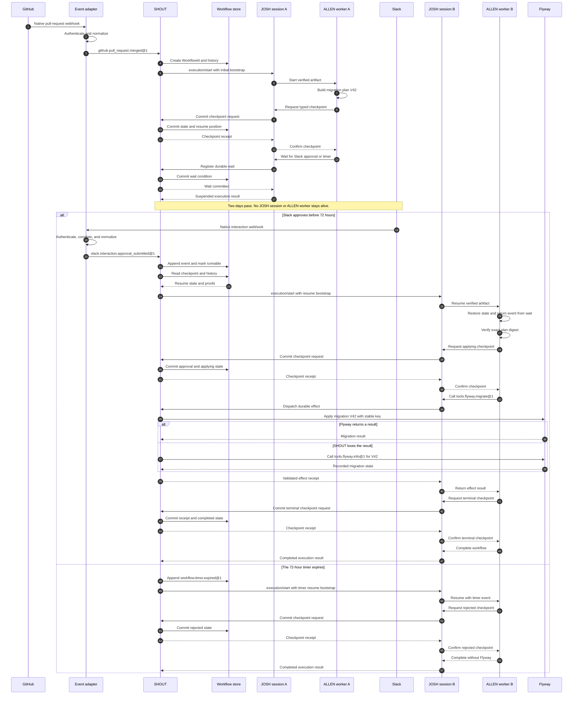

# PD-1: durable workflows

Status: Proposed

Depends on: [PD-2](PD-2.md), [PD-4](PD-4.md)

Back to the [roadmap](../../ROADMAP.md#proposed).

## Decision summary

Add an optional durable workflow profile to ALLEN. Use this profile only when
one logical workflow must outlive one runtime process.

Add SHOUT, a new durable workflow host. SHOUT means Stateful Host for
Out-of-process Updates and Triggers. It receives external events, stores
workflow history, schedules runs, and starts a fresh JOSH session for each run.
SHOUT is a new component. It is not part of the current implementation.

Extend ALLEN with durable checkpoint, suspension, and resume semantics. Extend
JOSH with a durable bootstrap contract that starts a new ALLEN execution from
either an initial event or a verified checkpoint and event. JOSH does not keep
the first execution alive and does not revive an old JOSH connection.

The profile has four core functions:

- Store typed state at explicit checkpoints.
- Wait for typed events after the current process exits.
- Resume under the same artifact and equal or narrower authority.
- Use PD-2 to reconcile an external mutation after an uncertain result.

The profile does not make each workflow durable by default. It does not claim
exactly-once execution for external tools.

### Current deployment boundary

Current deployments should use cron or Orca to start independent bounded
`josh run` executions. That is scheduling, not durability. Each start creates a
new run with no persisted ALLEN workflow state, restart-safe resume position,
or exactly-once guarantee.

Neither a scheduler nor a new run may automatically retry a headless-tool
mutation, or a future exec mutation, after an ambiguous result. Until PD-4
defines authenticated receipts and PD-2 defines accepted idempotency and
reconciliation semantics, an external system or operator must determine what
happened before authorizing another mutation.

SHOUT and the durable workflow profile remain a separate future milestone.
They come after PD-4 receipts and PD-2 effect semantics are accepted; cron or
Orca does not substitute for them.

The ownership boundary is:

```text
external system
      |
      | native webhook, queue message, or provider callback
      v
event adapter
      |
      | authenticated typed event
      v
SHOUT durable host
      |
      | durable execution bootstrap
      v
fresh JOSH session
      |
      | verified start or resume launch
      v
ALLEN runtime and VM
```

### Component name

SHOUT is a Bills reference and expands to Stateful Host for Out-of-process
Updates and Triggers. "Out-of-process" means that an external event or timer can
arrive after the previous JOSH session and ALLEN worker have exited. This avoids
overloading JOSH's existing `unattended` execution mode. The public names are
`shout`, `shout-protocol`, and `shout-host`.

## Why determinism is not enough

A deterministic workflow selects the same next command for the same state and
event history. This property makes replay and review reliable.

Determinism does not store state. It does not receive an event next week. It
does not start a replacement worker after the first worker stops.

The missing capability is durable coordination:

| Concern | Deterministic source | SHOUT |
|---|---|---|
| Select the same next command | Yes | Runs the deterministic source. |
| Keep state after process exit | No | Stores a typed checkpoint. |
| Receive a later external event | No | Stores, validates, and routes the event. |
| Start a replacement worker | No | Schedules a new run. |
| Preserve the wait position | No | Stores the workflow history position. |
| Reconcile an uncertain mutation | No | Applies the PD-2 effect contract. |

An application can build these functions with a database, queue, scheduler,
and custom recovery code. That application has built the equivalent of
SHOUT.

PD-1 is useful only when ALLEN must define portable checkpoint and resume rules
across hosts. If one host-specific workflow engine is acceptable, that engine
can run bounded ALLEN programs as activities. In that case, PD-1 adds little
value.

## Problem

ALLEN `0.1` owns tasks and opaque handles for one execution. The runtime closes
these values when the execution ends. This rule is correct for bounded work.

Some work includes a wait that is longer than one process lifetime. A human can
approve a migration two days after an agent prepares it. The first runtime
must not remain alive for those two days.

Replay cannot solve this problem. Replay reproduces recorded boundary results.
It does not accept a new live event and continue after that event. Current JOSH
also cannot solve it. A JOSH execution and its IDs belong to one live connection,
and disconnect ends that execution.

## Scope

This proposal adds:

- A stable `WorkflowId`.
- One versioned workflow state type.
- Explicit atomic checkpoints.
- Typed durable events and timers.
- Resume under a verified artifact and capability set.
- A canonical workflow history.
- PD-2 reconciliation at mutation boundaries.
- A new SHOUT service and its durable-host protocol.
- A JOSH bootstrap envelope for initial and resumed runs.

This proposal does not add:

- Durable child-agent references.
- State migration between artifact versions.
- Runtime tool discovery.
- Detached tasks.
- A general distributed transaction.
- An exactly-once claim for external effects.

Those features can use separate proposals after the core contract works.

## Terms

A workflow is one durable program instance.

A run is one process execution of that workflow.

SHOUT is the durable workflow host. It owns the `WorkflowId`, workflow store,
event acceptance, timers, scheduling, and run leases.

A JOSH session is one disposable connection used to run one bounded part of a
workflow. A later run uses a new JOSH session.

A durable checkpoint is one atomic typed state and history record. It is not a
process snapshot and is unrelated to the current VM `CheckpointObserver` used
for instruction-boundary observations.

A durable event is typed external input that either starts one workflow or
satisfies one stored wait.

A start event names a durable workflow declaration and stable start key. SHOUT
allocates the `WorkflowId` only after it accepts that event.

A resume event names an existing `WorkflowId` and stored wait through an opaque
correlation token.

An event adapter translates a provider-native webhook, message, or callback
into one authenticated durable event accepted by SHOUT.

A resume envelope contains the workflow identity, run identity, exact artifact,
checkpoint state, resume position, accepted event, history proof, and effective
authority needed to bootstrap one replacement run.

A worker runs one bounded part of a workflow. The worker is disposable.

## Component boundaries

PD-1 adds one component and changes two existing layers. None of the three may
silently take over another layer's responsibility.

| Component | Owns | Does not own |
|---|---|---|
| SHOUT | External event acceptance, workflow storage, timers, scheduling, run leases, and durable effect coordination. | ALLEN language semantics or a long-lived JOSH connection. |
| JOSH | One run's connection, provider routing, bootstrap decoding, execution supervision, and translation between SHOUT and the ALLEN runtime. | Durable workflow storage, webhook endpoints, or workflow scheduling. |
| ALLEN | Durable source semantics, state typing, resumable bytecode, verification, suspension, state restoration, and deterministic continuation. | External event listeners, databases, queues, or worker placement. |

An implementation may embed JOSH and ALLEN in the same worker process. The
ownership boundary still applies.

## SHOUT, the durable host

SHOUT is a coordination service. It is not the ALLEN worker process and it is
not an expanded JOSH session. Its own processes can restart because its store
preserves the workflow record.

SHOUT has these parts:

| Part | Responsibility |
|---|---|
| Workflow store | Store checkpoints, waits, events, and effect receipts. |
| Event ingress | Accept normalized events, validate receipts and schemas, correlate workflows, and deduplicate event IDs. |
| Event adapters | Receive provider-native webhooks or messages, authenticate the provider request, and produce normalized typed events. |
| Timer service | Create a typed event when a stored due time occurs. |
| Scheduler | Lease runnable workflow work to an available worker. |
| JOSH launcher | Open a fresh JOSH session and send a durable start or resume bootstrap. |
| Effect coordinator | Dispatch tools and apply PD-2 reconciliation rules. |

The first-party implementation should use separate `shout-protocol`,
`shout-host`, and `shout` crates. A deployment may back SHOUT with
PostgreSQL and a queue. `shout-protocol` must keep the durable-host contract
independent of one storage product so adapters for Temporal, Restate, or AWS
Step Functions can implement the same contract.

SHOUT owns persistence and scheduling. ALLEN source owns the typed state and
the decision about what to do after each event. JOSH translates between them
for one run.

### How external events enter SHOUT

GitHub, Slack, Stripe, and similar systems do not emit ALLEN values. A
deployment-specific event adapter receives their native webhook, queue message,
or callback. The adapter must:

1. Authenticate the native request under the PD-4 trust policy.
2. Extract or derive a stable provider event ID.
3. Route a start event to one workflow declaration and stable start key, or
   resolve a resume event's opaque correlation token to one `WorkflowId` and
   expected wait.
4. Convert the payload to the declared event schema.
5. Submit the typed event and issuer evidence to SHOUT event ingress.

SHOUT validates the normalized event again. It atomically appends an accepted
event and marks the matching workflow runnable. A scheduler retry must remain
possible if SHOUT crashes after acknowledging the provider request.

Correlation is an adapter responsibility. For example, a Slack approval button
can carry an opaque signed token that maps to a workflow and plan digest. Slack
does not need to understand `WorkflowId` or ALLEN.

## ALLEN changes

ALLEN implements logical resume. It does not restore an operating-system
process, native stack, socket, task, workspace, credential, or provider
connection.

The ALLEN implementation must add:

- A durable workflow declaration and one versioned durable state type.
- A manifest profile that declares state, input, output, events, effects, and
  limits.
- Compiler lowering from a durable workflow to stable resume points.
- A liveness rule requiring every value needed after a durable wait to appear
  in checkpoint state or the delivered event.
- Bytecode metadata and instructions for checkpoint, durable wait, suspension,
  and resume.
- Independent verification of resume positions, canonical state encoding,
  state schema, artifact binding, and forbidden execution-local values.
- A runtime start mode and resume mode.
- VM restoration that loads typed state at a verified resume point and makes
  the accepted event the result of the matching `event.wait`.
- A distinct durable-suspension outcome. Suspension is not completion,
  cancellation, failure, or the current source-level `stop` outcome.
- Recording and replay support for checkpoint, suspension, accepted event, and
  resume records.

The compiler may implement this as a state machine. The persisted resume
position must be a stable artifact-defined identifier, not a raw memory address
or an unchecked instruction offset.

## JOSH changes

JOSH remains a session host for one run. It gains the protocol needed to
bootstrap ALLEN on SHOUT's behalf.

The JOSH implementation must add:

- A negotiated durable-workflow feature and strict bootstrap schemas.
- A durable extension to `execution/start` with two variants: `initial` and
  `resume`.
- An `initial` bootstrap containing the SHOUT-issued `WorkflowId`, run ID,
  initial event, artifact binding, and effective authority.
- A `resume` bootstrap containing a verified resume envelope.
- Runtime-to-host requests for committing a durable checkpoint and registering
  a durable wait.
- A `suspended` execution result that returns only after SHOUT has committed
  the checkpoint and wait.
- Translation from the validated bootstrap envelope to ALLEN runtime start or
  resume APIs.
- Lifecycle events that distinguish initial runs, resumed runs, and durable
  suspension without confusing them with inbound durable events.
- Disconnect handling that cancels only the current run. The stored SHOUT
  workflow remains eligible for a later lease.

For each leased run, the SHOUT launcher follows the ordinary JOSH lifecycle on
a fresh connection. It initializes the connection, freezes the stored tool
catalog, loads the exact artifact, and calls `execution/start` with a closed
`workflow_bootstrap` value. The `initial` variant carries the accepted start
event. The `resume` variant carries the last checkpoint and the event that
satisfied its stored wait.

SHOUT runs use JOSH `unattended` mode by default. A `WorkflowId` is not an
`invoking_session_id` and must never be substituted for one. A future run may
bind a separately authenticated live invoking session only if the host supplies
one under the ordinary JOSH rules.

An illustrative resume value follows. The exact JSON encoding remains protocol
design work, but each field is required:

```json
{
  "workflow_bootstrap": {
    "kind": "resume",
    "workflow_id": "wf-42",
    "run_id": "run-8",
    "artifact_digest": "sha256:artifact",
    "catalog_digest": "sha256:catalog",
    "checkpoint": {
      "sequence": 7,
      "state_schema_digest": "sha256:state-schema",
      "state": {},
      "history_digest": "sha256:history"
    },
    "wait": {
      "resume_point": "wait-approval-1",
      "event_schema_digest": "sha256:approval-event"
    },
    "accepted_event": {},
    "effective_capability_digest": "sha256:capabilities"
  }
}
```

Current JOSH `execution/event` notifications are outbound run telemetry. They
are not the inbound durable events described by PD-1.

JOSH validates protocol shape and connection state. ALLEN validates artifact,
state, resume position, event type, and capability semantics. SHOUT validates
workflow history and decides whether to lease the run.

## Concrete example: approval-gated database migration

An agent prepares database migration `V42`. A release manager approves the
exact plan in Slack two days later. A new worker then applies the migration
through Flyway.

The names below are proposed ALLEN adapters. They are not part of ALLEN `0.1`.

| Name | Kind | Producer | Purpose |
|---|---|---|---|
| `github.pull_request.merged@1` | External event | GitHub | Start the workflow for one merged migration. |
| `slack.interaction.approval_submitted@1` | External event | Slack | Approve one exact migration-plan digest. |
| `tools.flyway.migrate@1` | Tool | Flyway | Apply migration `V42`. |
| `tools.flyway.info@1` | Tool | Flyway | Reconcile an uncertain migration result. |
| `workflow.timer.expired@1` | Timer event | SHOUT | End the wait after 72 hours. |

### Typed state

The checkpoint contains stable values. It does not contain a live task, tool
connection, workspace, or credential.

Illustrative future syntax follows. This syntax is not valid ALLEN `0.1`.

```allen
enum MigrationPhase {
  WaitingForApproval
  Applying
  Completed
  Rejected
}

record MigrationState {
  approval: Option<ApprovalReceipt<MigrationPlan>>
  migration: Option<EffectReceipt<MigrationResult>>
  phase: MigrationPhase
  plan: MigrationPlan
  pull_request: Int
  repository: String
}
```

### Workflow source

```allen
durable workflow apply_migration(source: PullRequestMerged)
  state MigrationState
  returns MigrationOutcome
  effects [
    workflow.checkpoint,
    workflow.event,
    workflow.timer,
    tool.flyway.migrate@1,
    tool.flyway.info@1,
  ] {
  let plan = migration_plan(source);

  let state = checkpoint MigrationState {
    approval: None,
    migration: None,
    phase: MigrationPhase.WaitingForApproval,
    plan,
    pull_request: source.pull_request,
    repository: source.repository,
  };

  let approval = match await event.wait<SlackMigrationApproval>({
    correlation: workflow.id(),
    name: "slack.interaction.approval_submitted@1",
    timeout: timer.after_hours(72),
  }) {
    Event(value) => value,
    TimerExpired(_) => {
      checkpoint rejected_state(state.plan);
      return MigrationOutcome.Expired { migration: "V42" };
    }
  };

  verify_approval(approval, digest(state.plan));
  checkpoint applying_state(state.plan, approval);

  let applied = await effect.idempotent({
    call: tools.flyway.migrate.call({ migration: "V42" }),
    key: workflow.key("flyway:V42"),
    reconcile: tools.flyway.info.call({ migration: "V42" }),
  })?;

  checkpoint completed_state(state.plan, approval, applied.receipt);

  MigrationOutcome.Applied { migration: "V42" }
}
```

In this illustrative syntax, the value returned by `checkpoint` is the durable
state binding. The compiler restores that binding when the wait resumes. A
plain local created before the checkpoint cannot be used after the wait unless
the checkpoint state contains it. The final syntax may differ, but this
liveness rule is required.

### Lifecycle

1. A GitHub adapter authenticates a native webhook and submits
   `github.pull_request.merged@1` to SHOUT.
2. SHOUT allocates a `WorkflowId`, creates the workflow history, and leases
   run A.
3. SHOUT opens JOSH session A and sends an `initial` durable bootstrap.
4. JOSH validates the bootstrap and starts ALLEN worker A.
5. ALLEN worker A creates the migration plan and requests an atomic checkpoint.
6. JOSH translates that request to SHOUT. SHOUT stores the state and resume
   position before it confirms the checkpoint.
7. ALLEN worker A reaches `event.wait`. JOSH asks SHOUT to register the wait.
8. SHOUT commits the wait. JOSH returns a `suspended` result and session A
   exits.
9. Two days later, a Slack adapter authenticates an interaction and submits the
   typed approval event to SHOUT.
10. SHOUT validates and stores the event, marks the workflow runnable, and
    leases run B.
11. SHOUT opens a new JOSH session B and sends a `resume` bootstrap containing
    the verified resume envelope.
12. JOSH validates the envelope shape and starts ALLEN worker B in resume mode.
13. ALLEN verifies the artifact, state, resume position, event type, and
    authority. It restores the durable state and returns the event from
    `event.wait`.
14. ALLEN worker B verifies the approval's stored plan digest and calls
    `tools.flyway.migrate@1`.
15. The workflow checkpoints the Flyway receipt and completes.

### Complete lifecycle diagram



## Proposed contract

The manifest declares each durable workflow. It names the input, output, state
type, effects, event schemas, and limits.

The compiler checks that the state has a canonical encoding. It rejects an
execution-local handle in that state.

SHOUT allocates each opaque `WorkflowId`. JOSH passes it to the ALLEN runtime in
the durable bootstrap. Source can read the ID through the workflow API but
cannot construct or modify it.

The first version resumes only under the same artifact digest. It does not
migrate stored state to new source code.

## Checkpoint rules

SHOUT commits these items as one operation:

- The new typed state.
- The state schema digest.
- The stable checkpoint resume position.
- The workflow sequence number.
- The program artifact digest.
- The frozen tool catalog digest.
- The effective capability digest.
- New event references and effect receipts.
- The previous and new history digests.

SHOUT must commit all items or no items. A partial checkpoint is invalid. JOSH
must not confirm the checkpoint to ALLEN until SHOUT returns its checkpoint
receipt.

The runtime resumes after the last valid checkpoint. It does not resume from
an uncommitted state image.

## Event and timer rules

Each event has an exact schema, issuer, and event ID. A start event has a
workflow declaration and stable start key. A resume event has a workflow and
wait correlation value. The event adapter authenticates the provider-native
request. SHOUT validates the normalized event and its evidence before delivery.

SHOUT accepts one event ID once. A duplicate with the same content returns
the first acceptance result. Changed content with the same ID is a protocol
failure.

The SHOUT timer service stores a logical due time. It creates
`workflow.timer.expired@1` when that time occurs. Replay uses the recorded timer
event and does not read the current clock.

A stored wait binds the last checkpoint, stable wait ID, artifact resume point,
accepted event schemas, correlation token, optional timer due time, and history
position. SHOUT must commit that record before JOSH reports `suspended`.

## Resume rules

Resume uses a new run and a new JOSH session. It never reconnects to or revives
the suspended run.

SHOUT verifies these items before it leases the new run:

- The workflow exists and is waiting for the accepted event.
- The history chain has no gap or fork.
- Each event and receipt verifies under the configured trust policy.
- No other worker holds a valid conflicting lease.

JOSH validates the resume envelope shape, binds it to the new execution, and
passes it to ALLEN. ALLEN verifies these items before source resumes:

- The program artifact digest matches.
- The frozen tool catalog digest matches the artifact binding.
- The stored state schema matches.
- The resume position exists in the verified artifact.
- The accepted event matches the suspended wait and declared event schema.
- The resumed capability set is equal to or narrower than the stored set.

A revoked or expired capability does not return after resume.

## Effect safety

PD-1 does not make external mutations exactly once. PD-2 defines idempotency,
reconciliation, compensation, and ambiguous results.

SHOUT records a stable effect intent before dispatch. The workflow stores a
confirmed mutation receipt in the next checkpoint.

If Flyway applies `V42` and SHOUT loses the response, SHOUT does not guess that
the call failed. It calls `tools.flyway.info@1` under the PD-2 contract.

## Recording and replay

The history records checkpoints, accepted events, timer events, effect intents,
effect receipts, and terminal state.

Replay verifies this history in order. It rejects a missing, duplicate,
changed, or reordered item.

Replay does not send a live Slack event. It does not run Flyway again. It
reproduces the validated recorded values.

## Security rules

- Source cannot construct a workflow ID or history position.
- A workflow ID cannot stand in for a JOSH invoking-session ID.
- A resume cannot increase authority.
- An event must name its target workflow and expected schema.
- A resume event can satisfy only the stored wait selected by its correlation
  token.
- An approval must bind the exact stored subject digest.
- A checkpoint cannot contain an execution-local handle.
- Workflow history uses the receipts from PD-4.
- Workflow storage preserves the labels from PD-3 when those labels exist.

## Failure cases

SHOUT, JOSH, or ALLEN must reject these conditions at the boundary that owns the
corresponding invariant:

- The artifact or state schema differs.
- The history chain has a gap or fork.
- A checkpoint contains a live handle.
- A required receipt does not verify.
- An event has the wrong workflow ID or schema.
- A start event reuses a start key with changed content.
- A resume event does not match the stored wait or correlation token.
- A duplicate event ID has changed content.
- Another worker holds a valid conflicting lease.
- Resume requests wider authority.

## Implementation work

### SHOUT

1. Add `shout-protocol` with strict workflow, run, event, checkpoint, wait,
   lease, history, and resume-envelope types.
2. Add `shout-host` with storage traits, transactional event acceptance,
   checkpoint commits, wait registration, timers, scheduling, run leases, and
   PD-2 effect coordination.
3. Add the `shout` service executable and a first storage and queue adapter.
4. Define an adapter API for provider-native webhook and message receivers.
5. Add the JOSH launcher that opens a fresh session for every leased run.

### ALLEN

1. Add durable workflow declarations, manifest rules, state typing, and
   diagnostics to `allen-syntax`, `allen-package`, and `allen-compiler`.
2. Lower durable workflows to stable resume points and reject values that cross
   a wait without entering durable state.
3. Add canonical durable metadata and checkpoint, wait, suspend, and resume
   instructions to `allen-bytecode`.
4. Verify durable state, resume positions, event types, artifact bindings, and
   forbidden handles independently.
5. Add initial and resume launch APIs, state restoration, event injection, and
   durable suspension to `allen-runtime` and `allen-vm`.
6. Extend `allen-testkit` recording and replay with durable history records.

### JOSH

1. Extend `josh-protocol` negotiation and `execution/start` with strict initial
   and resume bootstrap variants.
2. Add checkpoint-commit and wait-registration requests from the runtime to
   SHOUT.
3. Add the `suspended` execution result and durable lifecycle telemetry.
4. Extend `josh-host` to translate a SHOUT bootstrap into the matching ALLEN
   runtime launch API.
5. Preserve the current rule that disconnect cancels the active execution while
   allowing SHOUT to lease the stored workflow again.

### Cross-component proof

1. Define canonical history and receipt bindings shared at the protocol
   boundaries without making ALLEN depend on JOSH or SHOUT.
2. Apply PD-2 effect reconciliation and PD-4 receipt verification at every
   resume boundary.
3. Test process loss before and after every event, checkpoint, wait, lease,
   effect dispatch, effect receipt, resume, and terminal commit.
4. Update the language specification, implementation specification, JOSH
   protocol reference, agent references, examples, and conformance fixtures in
   the same implementation change.

## Acceptance tests

- Start one workflow from `github.pull_request.merged@1`.
- Accept the native GitHub webhook through an adapter and create one SHOUT
  workflow.
- Deduplicate a repeated GitHub start event without creating another workflow.
- Bootstrap worker A through JOSH with an `initial` envelope.
- Store the migration plan and return `suspended` only after SHOUT commits the
  checkpoint and wait.
- End JOSH session A and prove that no process-local handle enters storage.
- Prove that SHOUT does not use `WorkflowId` as `invoking_session_id`.
- Accept the native Slack interaction through an adapter and correlate it to
  the waiting workflow.
- Start a new JOSH session B and resume worker B with a `resume` envelope.
- Return the Slack event as the result of the stored `event.wait`.
- Reject a Slack approval for a different plan digest.
- Complete without Flyway after `workflow.timer.expired@1`.
- Reject a second delivery with changed content under the same event ID.
- Resume under equal or narrower authority.
- Reject a resume under a different artifact digest.
- Apply `V42` through `tools.flyway.migrate@1` with one stable key.
- Reconcile a lost Flyway response through `tools.flyway.info@1`.
- Replay the workflow without a live Slack event or Flyway call.
- Reject a checkpoint that contains a live task or workspace.
- Complete the workflow after SHOUT, JOSH, and ALLEN worker process restarts.
- Recover a runnable workflow when SHOUT crashes after storing an event but
  before launching JOSH.
- Recover from a lost worker lease without running two valid workers for one
  workflow position.

## Open decisions

1. Which storage isolation and durability guarantees must every SHOUT adapter
   provide?
2. Does one accepted event wake exactly one workflow, or may an event adapter
   fan it out into separately identified accepted events?
3. Which timer precision and delivery guarantees are portable?
4. Should state migration return in a later proposal?
