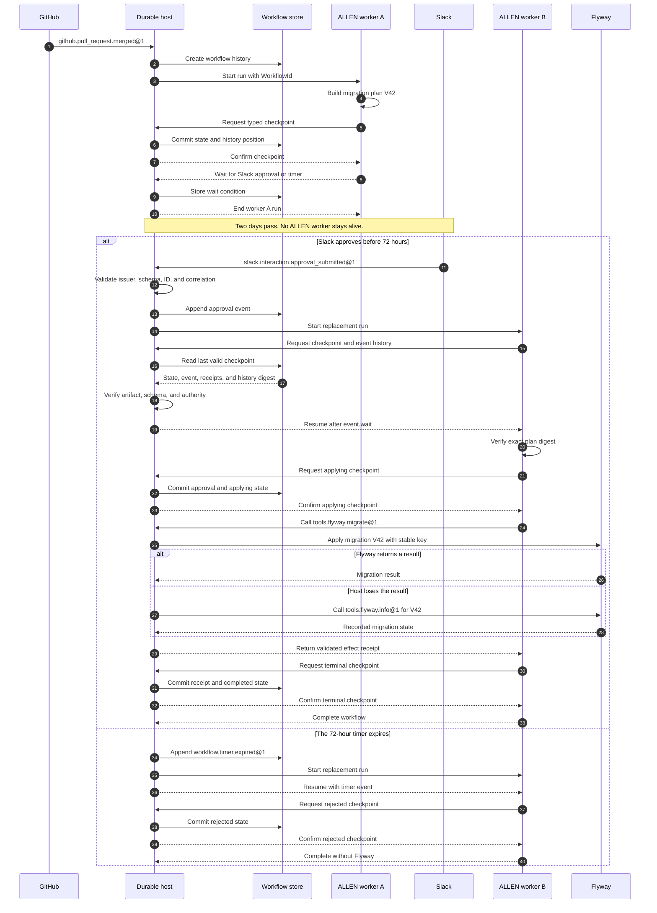

# PD-1: durable workflows

Status: Proposed

Depends on: [PD-2](PD-2.md), [PD-4](PD-4.md)

Back to the [roadmap](../../ROADMAP.md#proposed).

## Decision summary

Add an optional durable workflow profile to ALLEN. Use this profile only when
one logical workflow must outlive one runtime process.

The profile has four core functions:

- Store typed state at explicit checkpoints.
- Wait for typed events after the current process exits.
- Resume under the same artifact and equal or narrower authority.
- Use PD-2 to reconcile an external mutation after an uncertain result.

The profile does not make each workflow durable by default. It does not claim
exactly-once execution for external tools.

## Why determinism is not enough

A deterministic workflow selects the same next command for the same state and
event history. This property makes replay and review reliable.

Determinism does not store state. It does not receive an event next week. It
does not start a replacement worker after the first worker stops.

The missing capability is durable coordination:

| Concern | Deterministic source | Durable workflow host |
|---|---|---|
| Select the same next command | Yes | Runs the deterministic source. |
| Keep state after process exit | No | Stores a typed checkpoint. |
| Receive a later external event | No | Stores, validates, and routes the event. |
| Start a replacement worker | No | Schedules a new run. |
| Preserve the wait position | No | Stores the workflow history position. |
| Reconcile an uncertain mutation | No | Applies the PD-2 effect contract. |

An application can build these functions with a database, queue, scheduler,
and custom recovery code. That application has built a workflow engine.

PD-1 is useful only when ALLEN must define these rules across hosts. If one
host-specific workflow engine is acceptable, that engine can run bounded ALLEN
programs as activities. In that case, PD-1 adds little value.

## Problem

ALLEN `0.1` owns tasks and opaque handles for one execution. The runtime closes
these values when the execution ends. This rule is correct for bounded work.

Some work includes a wait that is longer than one process lifetime. A human can
approve a migration two days after an agent prepares it. The first runtime
must not remain alive for those two days.

Replay cannot solve this problem. Replay reproduces recorded boundary results.
It does not accept a new live event and continue after that event.

## Scope

This proposal adds:

- A stable `WorkflowId`.
- One versioned workflow state type.
- Explicit atomic checkpoints.
- Typed durable events and timers.
- Resume under a verified artifact and capability set.
- A canonical workflow history.
- PD-2 reconciliation at mutation boundaries.

This proposal does not add:

- Durable child-agent references.
- State migration between artifact versions.
- Runtime tool discovery.
- Detached tasks.
- A general distributed transaction.
- An exactly-once claim for external effects.

Those features can use separate proposals after the core contract works.

## Terms

A workflow is one durable program instance.

A run is one process execution of that workflow.

A checkpoint is one atomic state and history record.

An event is typed external input for one waiting workflow.

A durable host coordinates storage, events, timers, scheduling, and resume.

A worker runs one bounded part of a workflow. The worker is disposable.

## The durable host

The durable host is a coordination service. It is not the ALLEN worker process.
Its own processes can restart because its store preserves the workflow record.

A durable host has these parts:

| Part | Responsibility |
|---|---|
| Workflow store | Store checkpoints, waits, events, and effect receipts. |
| Event ingress | Validate issuers and schemas, then deduplicate event IDs. |
| Timer service | Create a typed event when a stored due time occurs. |
| Scheduler | Lease runnable workflow work to an available worker. |
| Runtime launcher | Verify the artifact, state schema, and authority before resume. |
| Effect coordinator | Dispatch tools and apply PD-2 reconciliation rules. |

A concrete host could be a JOSH service with PostgreSQL and a queue. A host
could also adapt Temporal, Restate, or AWS Step Functions to this contract.
The language does not require one product.

The host owns persistence and scheduling. ALLEN source owns the typed state and
the decision about what to do after each event.

## Concrete example: approval-gated database migration

An agent prepares database migration `V42`. A release manager approves the
exact plan in Slack two days later. A new worker then applies the migration
through Flyway.

The names below are proposed ALLEN adapters. They are not part of ALLEN `0.1`.

| Name | Kind | Producer | Purpose |
|---|---|---|---|
| `github.pull_request.merged@1` | External event | GitHub | Start the workflow for one merged migration. |
| `slack.interaction.approval_submitted@1` | External event | Slack | Approve one exact migration-plan digest. |
| `tools.flyway.migrate@1` | Tool | Flyway | Apply migration `V42`. |
| `tools.flyway.info@1` | Tool | Flyway | Reconcile an uncertain migration result. |
| `workflow.timer.expired@1` | Timer event | Durable host | End the wait after 72 hours. |

### Typed state

The checkpoint contains stable values. It does not contain a live task, tool
connection, workspace, or credential.

Illustrative future syntax follows. This syntax is not valid ALLEN `0.1`.

```allen
enum MigrationPhase {
  WaitingForApproval
  Applying
  Completed
  Rejected
}

record MigrationState {
  approval: Option<ApprovalReceipt<MigrationPlan>>
  migration: Option<EffectReceipt<MigrationResult>>
  phase: MigrationPhase
  plan: MigrationPlan
  pull_request: Int
  repository: String
}
```

### Workflow source

```allen
durable workflow apply_migration(source: PullRequestMerged)
  state MigrationState
  returns MigrationOutcome
  effects [
    workflow.checkpoint,
    workflow.event,
    workflow.timer,
    tool.flyway.migrate@1,
    tool.flyway.info@1,
  ] {
  let plan = migration_plan(source);

  checkpoint MigrationState {
    approval: None,
    migration: None,
    phase: MigrationPhase.WaitingForApproval,
    plan,
    pull_request: source.pull_request,
    repository: source.repository,
  };

  let approval = match await event.wait<SlackMigrationApproval>({
    correlation: workflow.id(),
    name: "slack.interaction.approval_submitted@1",
    timeout: timer.after_hours(72),
  }) {
    Event(value) => value,
    TimerExpired(_) => {
      checkpoint rejected_state(plan);
      return MigrationOutcome.Expired { migration: "V42" };
    }
  };

  verify_approval(approval, digest(plan));
  checkpoint applying_state(plan, approval);

  let applied = await effect.idempotent({
    call: tools.flyway.migrate.call({ migration: "V42" }),
    key: workflow.key("flyway:V42"),
    reconcile: tools.flyway.info.call({ migration: "V42" }),
  })?;

  checkpoint completed_state(plan, approval, applied.receipt);

  MigrationOutcome.Applied { migration: "V42" }
}
```

### Lifecycle

1. GitHub sends `github.pull_request.merged@1`.
2. The host creates a `WorkflowId` and starts worker A.
3. Worker A creates the migration plan.
4. Worker A requests an atomic checkpoint.
5. The host stores the state and wait position.
6. Worker A reaches `event.wait` and exits.
7. Slack sends the approval two days later.
8. The host validates and stores the Slack event.
9. The scheduler starts worker B.
10. Worker B verifies the artifact, state schema, and authority.
11. Worker B resumes after `event.wait`.
12. The runtime verifies that the approval names the stored plan digest.
13. Worker B calls `tools.flyway.migrate@1`.
14. The workflow checkpoints the Flyway receipt and completes.

### Complete lifecycle diagram



## Proposed contract

The manifest declares each durable workflow. It names the input, output, state
type, effects, event schemas, and limits.

The compiler checks that the state has a canonical encoding. It rejects an
execution-local handle in that state.

The runtime gives each workflow an opaque `WorkflowId`. Source cannot construct
or modify this ID.

The first version resumes only under the same artifact digest. It does not
migrate stored state to new source code.

## Checkpoint rules

The host commits these items as one operation:

- The new typed state.
- The state schema digest.
- The workflow sequence number.
- The program artifact digest.
- The effective capability digest.
- New event references and effect receipts.
- The previous and new history digests.

The host must commit all items or no items. A partial checkpoint is invalid.

The runtime resumes after the last valid checkpoint. It does not resume from
an uncommitted state image.

## Event and timer rules

Each event has an exact schema, issuer, event ID, and workflow correlation
value. The host validates these fields before delivery.

The host accepts one event ID once. A duplicate with the same content returns
the first acceptance result. Changed content with the same ID is a protocol
failure.

The timer service stores a logical due time. It creates
`workflow.timer.expired@1` when that time occurs. Replay uses the recorded timer
event and does not read the current clock.

## Resume rules

The host verifies these items before source resumes:

- The program artifact digest matches.
- The stored state schema matches.
- The history chain has no gap or fork.
- Each event and receipt verifies.
- The resumed capability set is equal to or narrower than the stored set.

A revoked or expired capability does not return after resume.

## Effect safety

PD-1 does not make external mutations exactly once. PD-2 defines idempotency,
reconciliation, compensation, and ambiguous results.

The host records a stable effect intent before dispatch. The workflow stores a
confirmed mutation receipt in the next checkpoint.

If Flyway applies `V42` and the host loses the response, the host does not guess
that the call failed. It calls `tools.flyway.info@1` under the PD-2 contract.

## Recording and replay

The history records checkpoints, accepted events, timer events, effect intents,
effect receipts, and terminal state.

Replay verifies this history in order. It rejects a missing, duplicate,
changed, or reordered item.

Replay does not send a live Slack event. It does not run Flyway again. It
reproduces the validated recorded values.

## Security rules

- Source cannot construct a workflow ID or history position.
- A resume cannot increase authority.
- An event must name its target workflow and expected schema.
- An approval must bind the exact stored subject digest.
- A checkpoint cannot contain an execution-local handle.
- Workflow history uses the receipts from PD-4.
- Workflow storage preserves the labels from PD-3 when those labels exist.

## Failure cases

The host must reject these conditions before source resumes:

- The artifact or state schema differs.
- The history chain has a gap or fork.
- A checkpoint contains a live handle.
- A required receipt does not verify.
- An event has the wrong workflow ID or schema.
- A duplicate event ID has changed content.
- Resume requests wider authority.

## Implementation work

1. Define the durable-host protocol and ownership boundaries.
2. Define the workflow manifest and state-schema rules.
3. Define canonical checkpoint and history records.
4. Add checkpoint instructions to bytecode verification.
5. Add event ingress, timer, and resume protocol messages.
6. Apply PD-2 effect reconciliation at resume boundaries.
7. Add recording and replay checks.
8. Test process loss at every checkpoint and effect boundary.

## Acceptance tests

- Start one workflow from `github.pull_request.merged@1`.
- Store the migration plan and end worker A.
- Resume worker B from `slack.interaction.approval_submitted@1`.
- Reject a Slack approval for a different plan digest.
- Complete without Flyway after `workflow.timer.expired@1`.
- Reject a second delivery with changed content under the same event ID.
- Resume under equal or narrower authority.
- Reject a resume under a different artifact digest.
- Apply `V42` through `tools.flyway.migrate@1` with one stable key.
- Reconcile a lost Flyway response through `tools.flyway.info@1`.
- Replay the workflow without a live Slack event or Flyway call.
- Reject a checkpoint that contains a live task or workspace.
- Complete the workflow after a process restart.

## Open decisions

1. Is the durable host a JOSH service or a host-neutral protocol only?
2. Which storage guarantees must every host provide?
3. Can an event start and resume more than one workflow?
4. Which timer precision and delivery guarantees are portable?
5. Should state migration return in a later proposal?
